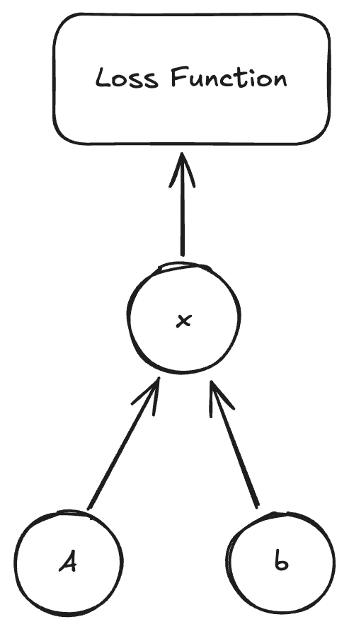

+++
title = "Backpropogate Circuits"
date = 2025-05-16
+++

Code visible [here](https://github.com/skunnavakkam/backprop-circuit-simulator).

We can backpropogate circuits (with limitations). Using a SPICE solver, which solves Kirkoff's laws, we can find voltages at nodes by solving the equation 

$$
Ax = b
$$

We define $A$ to be the *admittance* matrix, $x$ to be the *solution* vector, and $b$ to be the *source* vector. 

$$
A_{i j} = \text{admittance between node $i$ and node $j$}
$$
$$
x_i = \text{voltage at node $i$}
$$

$$
b_i = \text{source at node $i$}
$$

We can then sparse solve for $x$! However, how do we take gradients of $A$ and $b$ through $x$?

Here we reference the paper [JAX-FDM](https://arxiv.org/abs/2307.12407) which implements a backward pass for sparse solving!

For a system $Ax = b$, we have some gradients $g$ on $x$ (essentially $\frac{\partial L}{\partial x}$). We want to find $\frac{\partial L}{\partial A}$ and $\frac{\partial L}{\partial b}$.

By chain rule, we know

$$
\frac{\partial L}{\partial A} = \frac{\partial L}{\partial x} \frac{\partial x}{\partial A}
$$

$$
\frac{\partial L}{\partial b} = \frac{\partial L}{\partial x} \frac{\partial x}{\partial b}
$$

We then implicitly differentiate the system $Ax = b$ with respect to $A$ and $b$.

First, with respect to $A$. 

$$
\frac{\partial}{\partial A} (Ax) = \frac{\partial}{\partial A} (b)
$$

$$
x + A \frac{\partial x}{\partial A} = 0 \implies \frac{\partial x}{\partial A} = -A^{-1} x \implies \frac{\partial L}{\partial A} = - A^{-T} g x^T
$$

Then, with respect to $b$.

$$
\frac{\partial}{\partial b} (Ax) = \frac{\partial}{\partial b} (b)
$$

$$
A \frac{\partial x}{\partial b} = I \implies \frac{\partial x}{\partial b} = A^{-1} \implies \frac{\partial L}{\partial b} = (\frac{\partial L}{\partial x})^T A^{-1} = A^{-T} g
$$

Using these two, you can backpropogate through the linear system solver! Then, you can define a voltage vector $x'$ and define a loss function $L(x) = \text{mse}(x, x')$ and backpropogate through the circuit solver.

Another addition you can do to this is to take it over time. Instead of solving for $V$ at each node, you can solve for $\frac{dV}{dt}$ at each node, using $\frac{d}{dt} b$ as the source (note that $\frac{dA}{dt}$ is zero). This is a future addition that I hope to make :)

