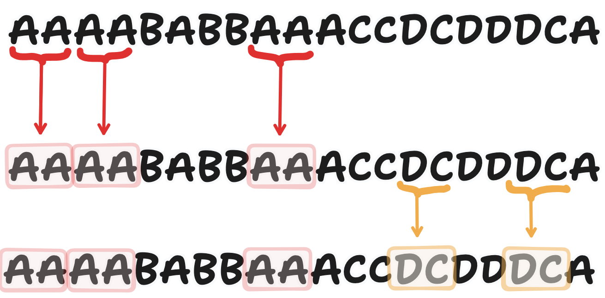
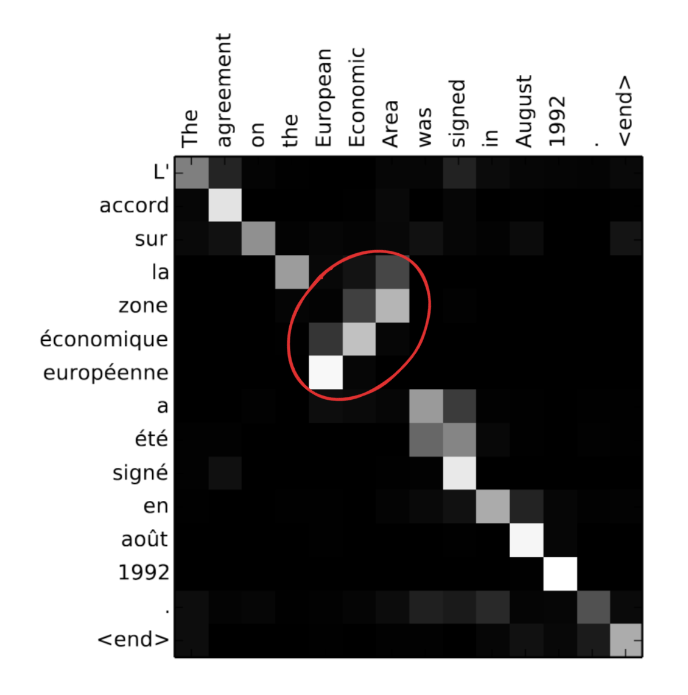
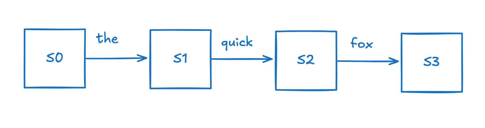
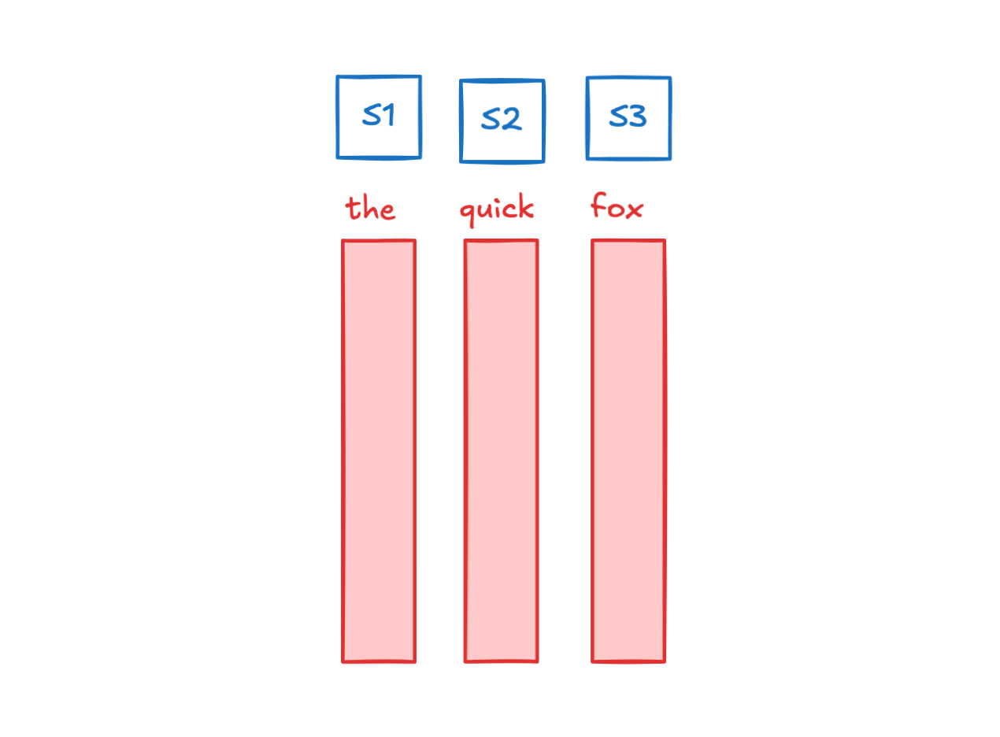

+++
title="Deriving the Autoregressive Transformer"
date=2025-09-01
+++

The year is 2015. You want to invent a model that can competently generate natural language. Here's how you might have been able to go about building the Autoregressive Transformer to its current form. The current transformer is a huge endeavor, shaped by many people, and many mistakes along the way, and this is an idealized scenario.

## Step 1: Breaking down text

Language typically doesn't fit into strict boxes. However, we want a way to compartmentalize language into smaller chunks that computers can understand. For this, we motivate the *Tokenizer*. You think back to the way that you were taught language. Let's look at the word "running". We know that the *-ing* at the end of the word is a suffix that indicates that the word is in the present text. In a way, the *-ing* suffix modifies the base word *run*.

Since we find it useful, these suffixes and other common parts of speech might also be useful abstractions to make it easier for the computer to learn language. We could perhaps break down `running -> run + -ing`. 

Doing this manually is not feasible, so we turn to the tokenizer. The tokenizer used in many LLMs, the byte-pair encoder (BPE) was invented in 1994, so a while before you set off on your endeavor. 

The BPE tokenizer works through looking through a training corpus and finding the most common pairs of bytes and merging them into a new token. This allows for more frequent n-grams to be represented as a single token, allowing both for compression and also more a more efficient and digestible representation of the language.



Before we go any further, we need to keep special tokens in mind. It's important for the model to be able to distinguish between the beginning of the sentence, or a user role, and the actual text. We can give these special tokens a unique token id, and we also do this at the tokenizer training step.

A naive implementation of the BPE tokenizer is pretty slow. Instead, we implement the BPE tokenizer using a heap to keep a track of active counts, and then use this to merge the most common pairs. The implementation can be found at `tokenizer.py` but Python pseudocode is below:

```python
class BPETokenizer:
    def __init__(self, special_tokens: list[str], vocab_size: int):
        self.vocab_size = vocab_size
        self.special_tokens = special_tokens

        # token->id and id->token (token as bytes at the boundary; internally we use ints)
        self.tok2id: Dict[bytes, int] = {bytes([i]): i for i in range(256)}
        self.id2tok: Dict[int, bytes] = {i: bytes([i]) for i in range(256)}
        self.curr_num_tokens = 256

        for token in special_tokens:
            tok2id[bytes([token])] = self.curr_num_tokens
            id2tok[self.curr_num_tokens] = bytes([token])

    def train(self, corpus: list[list[str]]):
    
```

This is still pretty slow, and takes a few hours to train on my laptop.

## Step 2: Embeddings (part 1)

Each token is represented as a single number between 0 and `vocab_size - 1`. However, this isn't a very good input format for the model. For one, the difference between two tokens is fairly small, and in order to get more information we have to train an expansion from the token id to a higher dimension vector. 

Instead, we can represent tokens as a 1-hot vector, such that $v_i = 1, v_j = 0, j \neq i$. This gives a vector that looks like

$$
\langle 0, \cdots, 1, \cdots, 0 \rangle
$$

We can then convert this to an embedding vector, which is a way to transform the 1-hot vector into a *dense* vector that contains some *semantic* information about the token. A convenient way to do this is with an embedding matrix $E$ with `vocab_size` rows and `embedding_dim` columns. Multiplying the 1-hot vector by $E$ acts as a lookup table. Correspondingly, I'm going to use $E(string)$ to refer to the embedding of the string. This embedding matrix gets trained through backpropogation during training. 

Some of the first approaches to embedding were done by Word2Vec in 2013, and its training process preserves semantics. This allowed for some cool results, such as being able to subtract and compare vectors. For example, 

$$
E("king") - E("queen") \approx E("man") - E("woman")
$$


## Step 3: Self-Attention

At this point, we have a sequence of tokens and we want a way to relate them to each other and generate new tokens. Here's one way of going about this.

### Attention

Let's take a small detour into machine translation. From previous work, we've had models that predict text, like Seq2Seq. However, since language is *contextual*, you might want a way to emphasize certain parts of the input to decode certain parts of the output state.

To do this, we might compute a pairwise score between input and output tokens as a form of relevancy. This was first done with a small MLP

$$
e_{i, j} = v_a^T \tanh(W_d h_j^{dec} + W_e h_i^{enc})
$$

The actual formulation here is a little arbitrary, but since $h^{dec}$ and $h^{enc}$ belong in different vector spaces (sub-manifolds? the idea is that these don't have similar semantic mappings from vector direction -> concept), we use an MLP to learn how much attention to pay. Then, to convert these values to a distribution of which input tokens we should consider, we then softmax over the input tokens.

This produces the following example for machine translation



The circled region implies that information about from the token "Area" corresponds to the french "Zone" instead of "europeèn" as it would have been had you just been matching token positions.

Instead of doing attention with an MLP, we can instead ensure that the dimension of $h^{dec}$ is the same as $h^{enc}$ so that we can do dot product attention where these attention scores are simply $\langle h^{dec}, h^{enc} \rangle$. In the case where $\langle h^{dec}, h^{enc} \rangle$ does not result in appropriate scores, we can instead learn a linear transformation that allows us to compute better scores.

We can do the matrix product

$$
Q = W_q h^{enc}; K = W_k h^{enc};
$$

and compute attention scores as $\langle Q, K \rangle$.

This attention mechanism was first introduced by Bahdanau in 2014 and Luong in 2015 and was used for RNNs for machine translation. In this context, RNNs serve as the way to move information from the input tokens to the output tokens, where they then get decoded. RNNs work by updating their hidden state based on the previous hidden state and the current input token.



For Bahdanau attention, the hidden state after each token is a vector that represents the encoding of the input token, in addition to the additional context from the previous hidden states. This is done passed to a seperate decoder RNN which takes in inputs as attention-weighted hidden states from the encoder.



However, training RNNs is terrible. Since you have to backpropogate through a huge chain of hidden states, if your matrices have determinants too far from 1, your gradients will vanish / explode. It's also computationally expensive to do this, since you have trouble parallelizing this with GPUs.

### Attention is all you need

Instead, we can get rid of the RNN and try to implement the idea of moving information from input tokens to output tokens purely with attention and an MLP. So far, we have a way to quantify how much a particular input token is relevant to a particular output token, we now need to figure out how to update the hidden token. 

To keep notation clean, let's refer to the input embeddings $h_i^{enc}$ as $h_i^{dec}$ let $Q = W_q h_i^{dec}; K = W_k h_i^{dec}$. The first thing that pops into your mind might be tocompute updates through putting $concat(h_j^{dec}, h_i^{enc})$ through an MLP. However, this does $O(n^2)$ FFN computations, which is too expensive. Instead, we can create these update *values* through a linear transformation given by $V = W_v h_i^{dec}$ and then compute an MLP over everything.

We so far have our three values: queries $Q$, keys $K$, and values $V$. We have everything we need to build our attention mechanism

$$
\text{attention} = \text{softmax}(\frac{QK^T}{\sqrt{d_k}})V
$$

<details>
<summary>Why do we divide by $\sqrt{d_k}$?</summary>

We want the magnitude of our attention scores to not grow too much with the dimension. Let's see what happens when we take the dot product of $q$ and $k$, two vectors from $Q$ and $K$ respectively.

Expanding out the dot product we get

$$
q \cdot k = \sum q_i k_i
$$

We can take the variance of this to see how large values might be, assuming that $\mathbf{E}[q_i] \approx \mathbf{E}[k_i] \approx 0, \text{Var}(q_i) \approx \text{Var}(k_i) \approx 1$.

$$
Var(q \cdot k) = Var(\sum q_i k_i) = \sum Var(q_i k_i) + 2 \sum_{i < j} Cov(q_i k_i, q_j k_j) = \sum Var(q_i k_i)
$$

since we assume that $Cov(q_i k_i, q_j k_j)$ due to being different index positions.

We then have that

$$
Var(q_i k_i) = \mathbf{E}[q_i^2 k_i^2] - \mathbf{E}[q_i k_i]^2 = \mathbf{E}[q_i^2] \mathbf{E}[k_i^2] = 1
$$

This gives 

$$
Var(q \cdot k) = \sum Var(q_i k_i) = d_k \implies \sigma(q \cdot k) = \sqrt{d_k}
$$

Thus, we divide by $\sqrt{d_k}$ to keep the standard deviation of the attention scores
</details>

### Multi-head Attention

In attention, we have keys, queries, and values, which are our $K, Q, V$ respectively. However, the dot product $\langle Q, K \rangle$ is a single number and doesn't represent much complexity about the keys and the queries. As a result, the diversity of attention being paid to the tokens is limited.

Instead, we can split up our matrices into $h$ heads which each produce a different output.