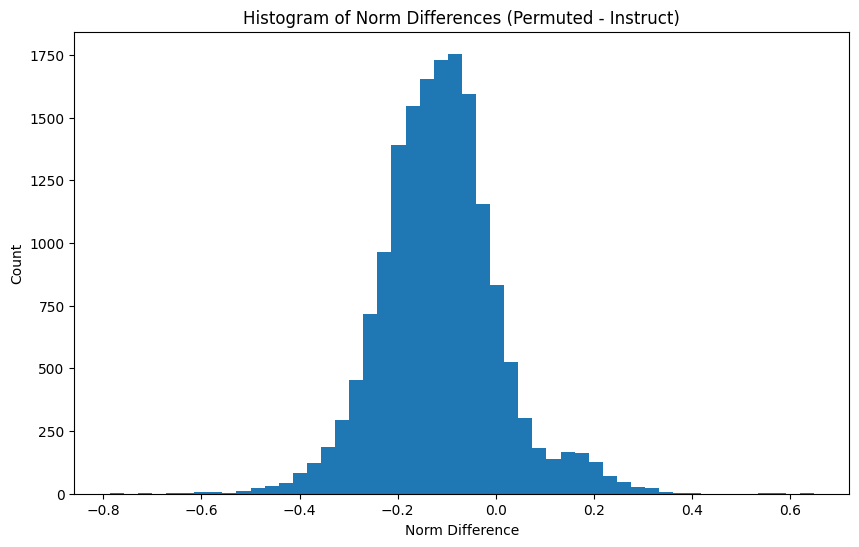

+++
title = "Diffing Models Without Crosscoders"
date = 2024-11-28
+++

I think that it should be possible to "diff" models like Anthropic does in their crosscoder paper, without training a crosscoder! 

We can think of a transformer $T$ as a function from an activation vector to a piece of text in semantic space. Defining addition in this semantic space is kind of tricky, but we say that if we add together two pieces of text that are "happy", we get a piece of text that is happier.

From the initial paper on sparse autoencoders, we know that for two feature vectors $U, V$:

$T(U + V) \approx T(U) + T(V)$

Take this approx with a huge grain of salt, but we can then say that this transformer is a linear map between the SAE feature space and the semantic space.

If for two different transformers $T_1, T_2$ acting on activation spaces $A_1, A_2$, we can find a linear map from $A_1$ to $A_2$ that best aligns the two models, and because the transformer is linear, this alignment should be pretty good! We can then look at where this alignment fails and use that to understand differences between the two models.

This linear map from $A_1$ to $A_2$ is like a change of basis between the two model activation spaces.

Basically, you can find a transformation between the features of one model and the features of another model, and where this transformation fails is where the two models have the most difference.

In this post / notebook, I show emperical evidence that this may be possible!

## Method

The method is as follows:

I first learn a linear map between activation spaces $A_1$ and $A_2$ of two different models $T_1, T_2$. I do this by collecting a dataset of activation vectors from each model on the same pieces of text, and learn the linear map $R$ that best converts between the two activation spaces.

I then take the features that form the basis for the feature spaces $F_1, F_2$. We can convert all the features in $F_1$ to the $F_2$ space using the linear map $R$, but I don't know correspondence between the features in $F_1$ and $F_2$. Thus, I use the linear assignment solver / hungarian algorithm to find the best permutation of the features in $F_1$ that minimizes the distance to the features in $F_2$. 

I take this alignment for granted, and say that it is perfect. Then, we can say that this is basically the same thing as the crosscoder vector, and just like the crosscoder we can look at the encoder norms to the permuted features in $F_1$ and the encoder norms to the features in $F_2$. Where these differ the most is the features where the models have the most difference.

In order to test this, I use the self-interp method introduced in [Self-explaining SAE Features (Kharlapenko et al.)](https://www.alignmentforum.org/posts/8ev6coxChSWcxCDy8/self-explaining-sae-featuress). This is not ideal, and having the dashboards for this SAE would be best, but I don't have access to this.

## Conclusions

In this section, I use the term *positive feature* to refer to a feature that is present in the base model but not in the instruct model, and *negative feature* to refer to a feature that is present in the instruct model but not in the base model. I do this because these are the corresponding signs of the difference between the encoder norms corresponding to the features.

As expected, many of the features are not interpretable. This is normal, and is expected given that we only use the self-interp method. However, there are still some nice features! A couple of the positive examples discuss sexual things (cranking up this feature makes the model talk about MILFs):

```
Steering with feature 11453: The meaning of X sexually is that it is a symbol of the unknown. It can be used to represent anything that is not known or understood.

<h2>What does the
```

I'm finding it difficult to interpret the negative features. I think that this is best done through looking in a dashboard though.

Furthermore, when looking at norm differences, we get something similar to what the crosscoder paper gets!



This is still a work in progress. My next step is to look at the top 30 positive and negative features and see if I can make sense of them.