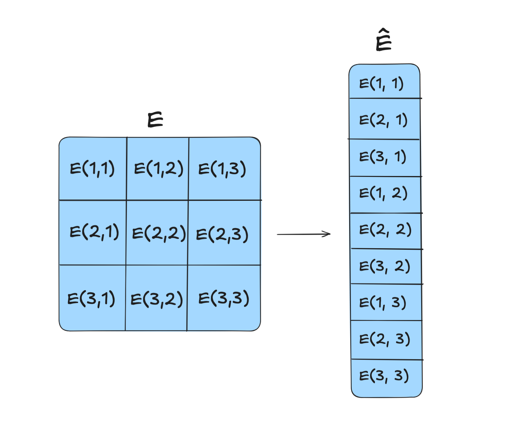
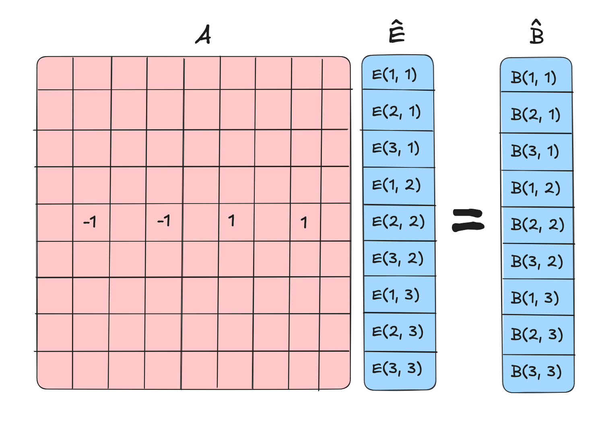
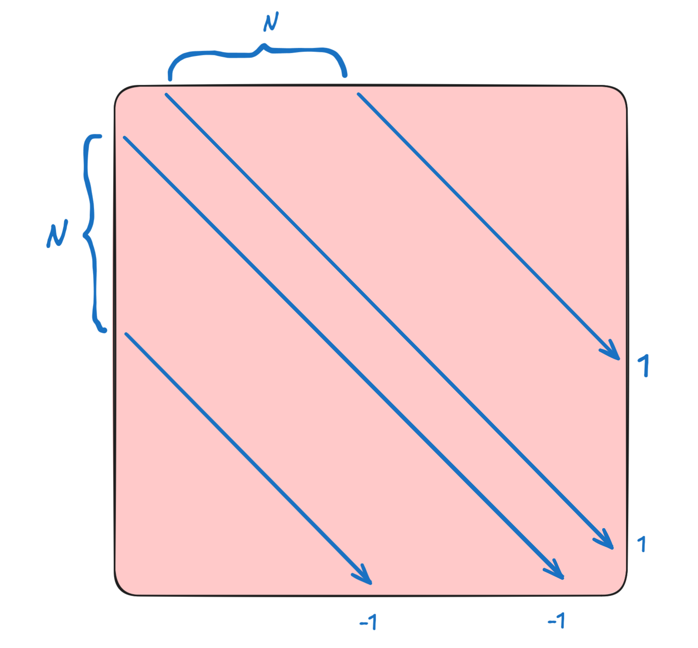
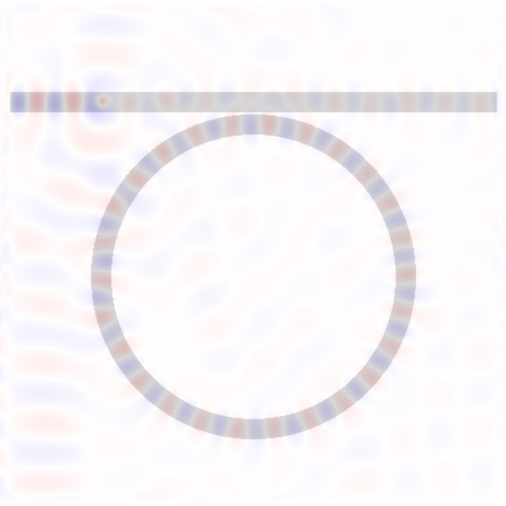
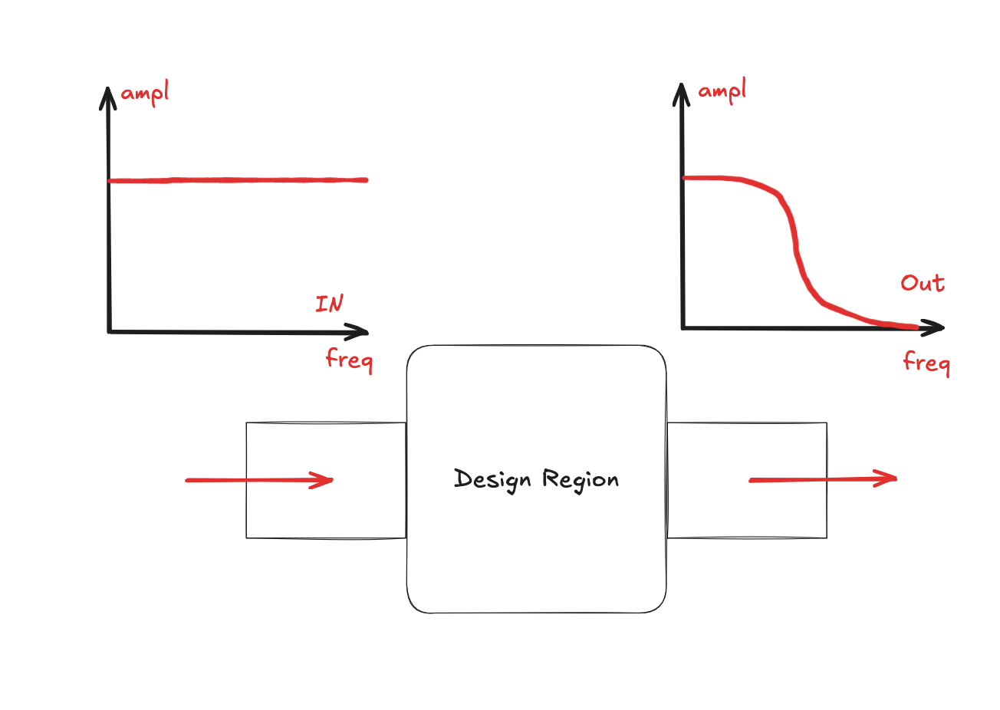
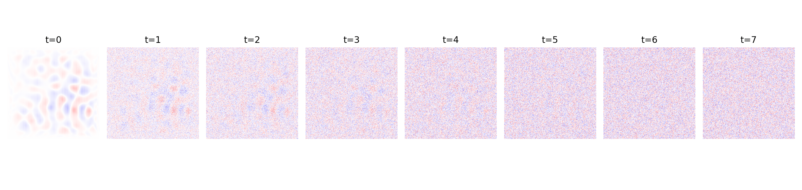
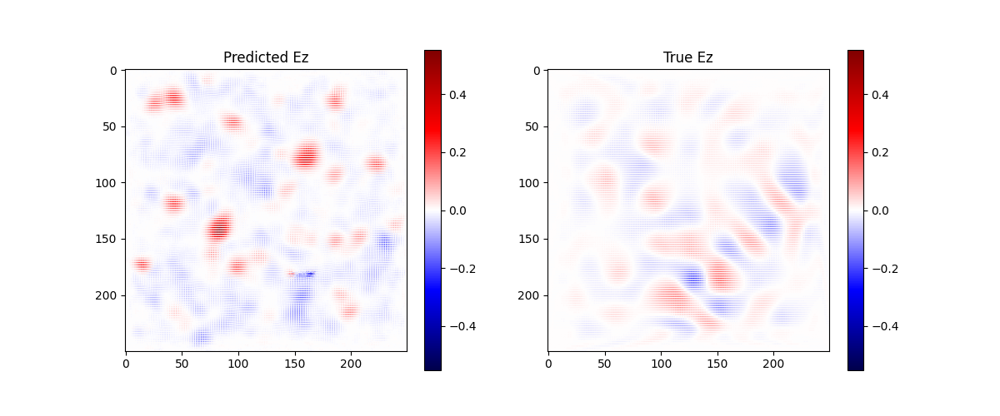
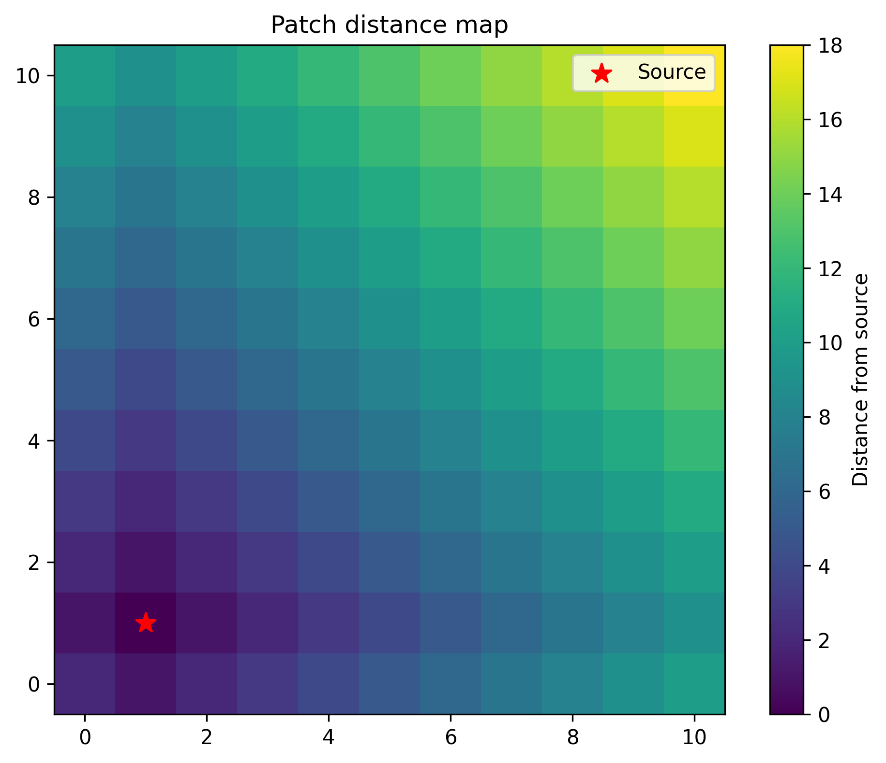
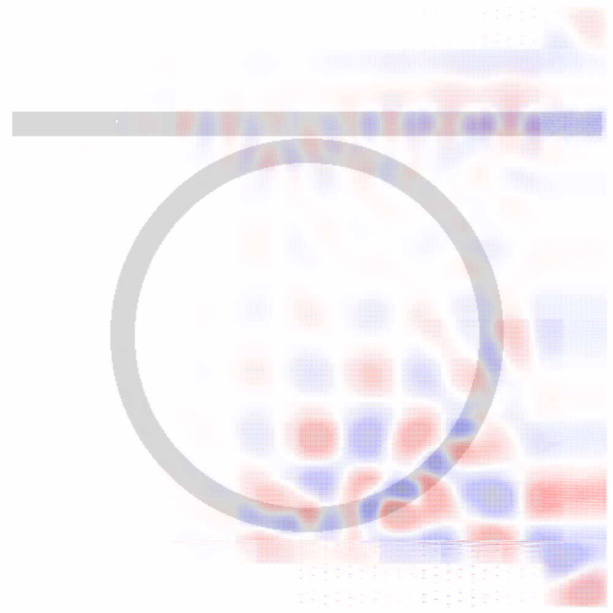

+++
title = "Implementing E&M Simulators"
description = "Backpropogatable FDFD and FDTD simulators in Jax, and trying to use diffusion models, tiled preconditioning, and other tricks to try to make them faster"
date = 2025-07-28
draft = false
+++

E&M is largely governed by Maxwell's equations, a set of partial differential equations that describe the behavior of electric and mangetic fields.

Almost all E&M can be modeled by Maxwell's equations, and almost all other E&M phenomenon can be modeled this way. As a result, E&M simulators based on Maxwell's equations are widespread.

To start, let's look at Maxwell's curl equations.

$$
\nabla \times \mathbf{E} = - \frac{\partial \mathbf{B}}{\partial t} = -\mu \frac{\partial \mathbf{H}}{\partial t}
$$

$$
\nabla \times \mathbf{H} = \frac{\partial \mathbf{D}}{\partial t} = \epsilon \frac{\partial \mathbf{E}}{\partial t}
$$

However, getting from these equations to a simulation is not straightforward, and this blog post will walk through the process and motivation of implementing and optimizing a simulator in 2 dimensions. 

## Maxwell's Curl Equations in 2D

We can pick two polarizations of light in 2D, one where the electric field is perpendicular to the plane of the paper, and one where the electric field is in the plane of the paper. These are the TE and TM modes respectively. In the TE mode, the electric field only contains a $z$ component, and the change in the $z$ component $\frac{\partial E_z}{\partial t}$ is 0. In this case, we can expand the curl operator to be

$$
\nabla \times \mathbf{E} = \begin{vmatrix}
\mathbf{i} & \mathbf{j} & \mathbf{k} \\
\frac{\partial}{\partial x} & \frac{\partial}{\partial y} & \frac{\partial}{\partial z} \\
E_x & E_y & E_z
\end{vmatrix}
$$

## FDTD

In FDTD, we step through time steps and update the fields at each time step. We update the $E$ field at time $t$ and the $B$/$H$ field at time $t + \frac{1}{2}$ (arb units). Doing this in numpy leads to fast results, which we can later optimize using FNOs.

`fdtd.mp4` shows the propagation of a wave through a medium with varying permittivity:

## FDFD

FDTD is an extremely good way to solve Maxwell's equations for transient sources, but oftentimes in photonics simulations we are concenred about the state of a system after a very long time passes, or the steady state. Steady state solutions happen rapidly in light-matter simulations due to the high speed of light! The relation between time-domain and frequency-domain signals by the Fourier transform already gives a hint that we can solve for the steady state at a given frequency!

This is a really nice solution, since we often only care about the behavior of light with constant frequency sources such as a red laser. 

We can take Maxwell's equations in the frequency domain, which yields 

$$
\nabla \times \mathbf{E} = i \omega \mu \mathbf{H} = i \omega \mathbf{B}
$$

Since we say that $\mathbf{B} = \Re(B_0 e^{i \omega t})$, and from Maxwell's equations we have that $\nabla \times \mathbf{E} = -\frac{\partial \mathbf{B}}{\partial t}$, we can then differentiation $\mathbf{B}$.

$$
-\frac{\partial \mathbf{B}}{\partial t} = i \omega \cdot B_0 e^{i \omega t} = i \omega \mathbf{B}
$$

This equation works with a continuous E-field and B-field, but we can discretize it to get a matrix equation. We can unravel the $E$ and $B$ fields (each initially with discretized shape $N_x, N_y$) into a single vector $\hat{E}$ and $\hat{B}$ with shape $N_x \times N_y$ We can then generate an operator $curl: \mathbb{R}^{N_x \times N_y} \to \mathbb{R}^{N_x \times N_y}$ that takes the curl of the field. Constructing this field is given by the Crank-Nicolson method, but I'll also provide some motivation here with a smaller sample, taking the curl of a $3 \times 3$ grid. 

First, flatten the grid into a vector.

We can then try to compute the curl at $(2, 2)$. We should first the discrete $\frac{\Delta E}{\Delta y}$ and $\frac{\Delta E}{\Delta x}$ at $(2, 2)$.

$$
\Delta E_x = \frac{E_{2, 3} - E_{2, 1}}{2}`
$$

$$
\Delta E_y = \frac{E_{1, 2} - E_{3, 2}}{2}
$$

We then have that the curl at $(2, 2)$ is

$$
\nabla \times \mathbf{E} = \frac{\Delta E_x}{\Delta x} - \frac{\Delta E_y}{\Delta y}
$$

We can then construct a matrix that takes the curl of the field at that point.

In general, you get a matrix of this form, sometimes called an *outrigger* matrix. 

This yields a system of equations

$$
A \hat{E} = -i \omega \hat{B}
$$

We can then solve for $\hat{E}$ using a sparse solver. Recall that the matrix has shape $(N_x \times N_y, N_x \times N_y)$, but only has $4$ non-zero entries per row. This is a big matrix, but it is sparse, and it is a banded matrix. 

We solve this system of equations using a sparse solver like `scipy.sparse.linalg.spsolve` and voila! Look at this perfect ring resonator coupling!

### Rewriting in Jax

In the main `fdfd.py` file, the core function is `make_A` which generates the matrix $A$ from the permittivity, permeability, and source. I want to rewrite this in Jax so I can have the ability to backpropagate through it. However, like many other libraries, Jax has *really bad* support for sparse matrices, so we have to go around it and implement other things like our own sparse matrix operations by registering custom forward and backward passes for `scipy.sparse` subroutines.

However, with some help from o3 this works pretty well, and now we can backprop through the FDFD solver and do inverse design to some extent. Let's suppose that we want to do a low pass filter, so only low frequencies of light are allowed to pass through. 

Let's start! You can see the code here in `inverse_design.py`.

### Diffusion Modelling

Diffusion models are probably very good at solving these types of problems, and things like `DiffusionPDE` already show some promise! I think diffusion modelling can be thought of as a heuristics-based iterative solver. 

We first generate the data by generating random permittivities and sources, and then running the FDFD solver to get Ez fields. Then, with a cosine noise scheduler, we add noise to the Ez fields to train the denoising diffusion model. The noisy steps are shown below.

We train the diffusion model with DDPM using SNR loss and a cosine noise scheduler, and after 90 epochs ($90000$ samples), we get the following results.

The model definitely learns some of the dynamics, and is not perfect, but with time should be a lot more competent! I'm going to run it on ~2000 epochs after this post. 

### Tiled FDFD

The uniqueness and existence theorem gives that the boundary conditions of a system are sufficient in determining the solution in the system. Maybe we can then solve for the solution in the area around the source, and then solve for the solution in patches adjacent to that, and so on and so forth. 

The image above shows the distance of each patch from the source patch (marked with a red star). The colors indicate how many patches away from the source each patch is, with lighter colors being further. What happens if we solve for the solution in each patch, enforce some dirichelet boundary conditions at each point, and then use the solution in the patches to solve for the solution in the next patch? Let's implement this, solving for patches in a partial ordering given by distance from the source, determined by Djikstra's. 

Some basic math shows that this solution happens in $O(n^2)$ time (technically $O(n^2 \log n)$ time since Djikstra's is $O(n^2 \log n)$ but the time taken for Djikstra's is negligible compared to the time taken to solve the sparse system of equations), which is a little too good to be true, and this is evidence by the solution not working perfectly. I think this probably ends up being a good approximation for a solution after a long but not infinite time, and I think that with a little bit more work this can serve as adequate preconditioning for a matrix solve, or this can work in a similar iterative fashion to an iterative matrix solver. Some hints that this might work are that you see coupling to the ring resonator (look at the bottom right quadrant).

My implementation of this is about 5-7x faster than the native sparse solve, since I tile $100 \times 100$-sized patches patches with overlap of $20$ pixels, leading to sparse solving a $120 \times 120$ matrix $100$ times. This takes about 3 seconds. The direct sparse solve of $1000 \times 1000$ matrix takes about 20 seconds.

Pulling a number out of nowhere, I think that the ideal solution happens in about $O(n^2 \log n)$ time. My justification of this is solving the patches takes $O(n^2)$ time, and there would be $\log n$ iteration steps if each iteration step was a constant multiple better (for example, if we needed $10^-2$ tolerance, and each iteration step was $10$x betterm then there would be $\log_{10} (100) = 2$ iteration steps)..

