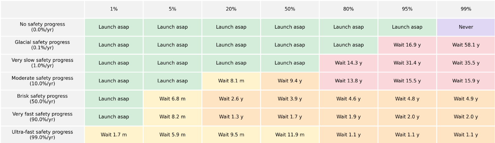
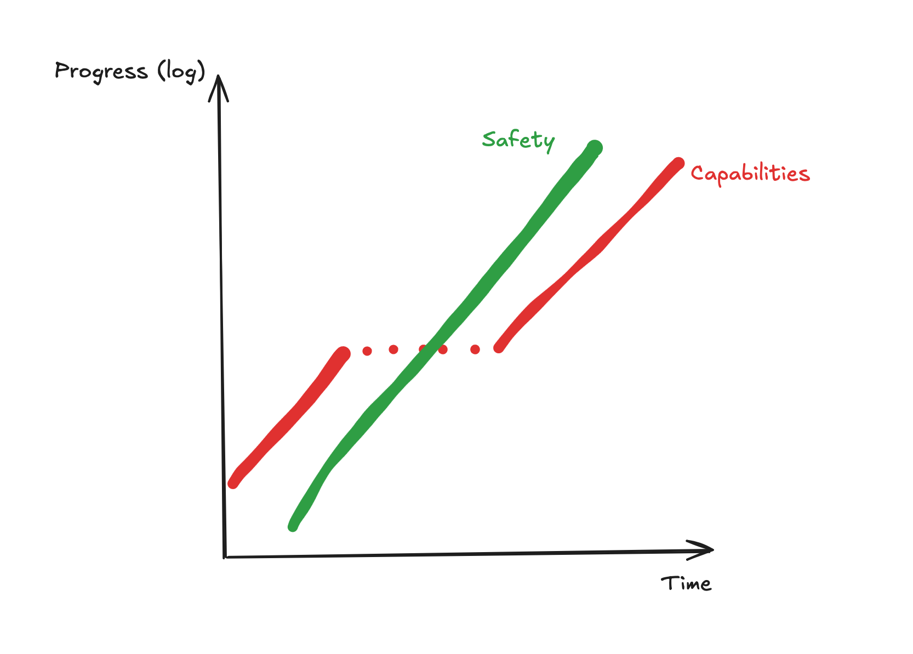
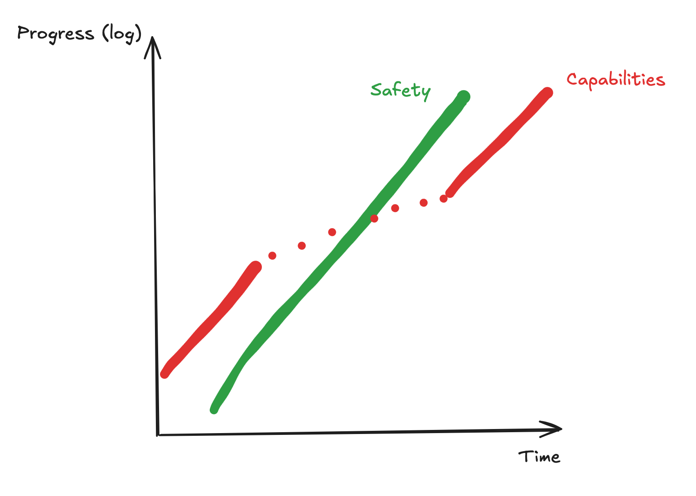

+++
title="How Should We Implement an AI Pause?"
date=2026-04-22
draft=false

[extra]
unlisted=true
+++

AI development is moving fast, and alignment research is not moving fast enough to deal with superintelligent
models. This is a problem. One of the most proposed solutions to this is to implement
and AGI pause or slowdown - make it take longer to build AGI, so alignment research
can catch up in the meantime. However, it's unclear to me how proponents of an AGI pause
want this to be implemented.

To be clear, I'm not arguing that passing an AGI pause is out of the realm of possibility.
It seems to me that the major American labs - OpenAI, Anthropic, Google, Meta - are all 
law-following organizations, and thus American AGI regulation would work on them. Similarly,
I think that a US-China AGI pause is also possible. I instead write this post to discuss what
such legislation might entail.

To examine my concerns with current pause proposals, I'll consider PauseAI's proposal[^1] for an AI pause.

> Implement a temporary pause on the training of the most powerful general AI systems, until we know how to build them safely and keep them under democratic control.

I have a few major concerns with this:

1. How do you understand when AGI is safe to build?
2. To what extent do you risk a safety overhang?
3. How do you ensure and understand when alignment research has caught up?

In addition, I have a few other wants during an AI pause that I'll discuss.

# Resuming AGI Development

Despite having good intentions, many environmental justice groups have shaped the
world for the worse. Nuclear power has had it's reputation soiled by anti-nuclear 
groups, causing a shift from nuclear power to more traditional fossil fuels. This
cost many lives. Similarly, the increase in regulations on construction and industry
that was driven by the environmental movement has caused meaningful suffering in
the US - yet, at the time they proposed their regulation, they were probably
entirely justified in their actions.

AGI, as imagined, will be a transformative technology. It's unclear to me how AGI
will affect the world economically, but enabling humanity more capability for
intellectual work will without a doubt lead to progress. 

In [Optimal Timing to Build Superintelligence](https://nickbostrom.com/optimal.pdf),
Nick Bostrom tries to understand when to build superintelligence, given some
priors over the progress of safety research and risk, presenting the following
graph. I recommend reading the paper, which examines "how to pause", just like this
post.

Even if I disagree with their specific numbers, I agree with their overall point -
that intelligence is useful, and that we should build it when it's safe enough to 
do so. One of my most significant worries with AGI pausing is that we extend the 
pause indefinitely and subsequently miss out on all the benefits that come with it.

Furthermore, there are actors that may not comply with an international pause, such
as AGI projects from rogue states, terrorist groups, and other non-state actors; 
despite not being real contenders in the current AGI race, after algorithmic 
improvements and compute access being more widespread, it seems feasible that
in a few decades anyone could build towards AGI. 

To this extent, we should almost guarantee that AGI development continues, unless
alignment is entirely unfeasible. This is a risk that we should be willing to take.
We should thus work towards understanding _when_ we feel comfortable resuming AGI
development. 

This is really difficult - you're dealing with unknown unknowns here, since it's
unclear what the landscape of alignment is going to look like. With access to the 
most recent models (Claude Opus 4.7 and Codex 5.4) at time of writing, there are 
enough gaps in our understanding of current models that making progress towards 
alignment is meaningfully possible. 

However, I think all of this leaves room for optimism! The first pause will be huge
and monumental, and it will require building further infrastructure to support coordination.
Consider the following model:

This models a true pause - there's no capabilities overhang that causes the rate of
capabilities progress to rapidly accelerate after the pause is lifted. We're also
assuming the acceleration of safety research due to automation of alignment. 

Furthermore, it assumes that the rate of safety progress is comparable to the rate
of capabilities progress. It's unclear to me whether this is reasonable - it seems 
clearly false at the moment, but this might be just because the field is less mature
than ML as a whole - in a few years, the duration of a pause, will the rate of safety
research catch up to capabilities progress? I'll touch on this later.

As it stands, in the case of any pause, we would want for the safety research to 
have progress as much as capabilities research post-pause, and also we would want
for the rate of progress of safety research (loosely the exponent on the exponential)
to be comparable to the rate of progress of capabilities research. To ensure that
we can resume AGI development, we counterintuitively want to be more rigorous about
pausing - setup infrastructure to measure the rate of safety progress, and also
set up infrastructure to ensure that, if we resume AGI development too early, we 
have the optionality to pause again. If we make it so that we can pause again, we
can unpause easier and bring about abundance faster.

# Safety Overhangs

Even in a pause, labs should have access to huge amounts of compute. Claude Code and
Codex and other products in their class have been hugely beneficial for the world, 
and the world hasn't adapted to them as they've come. Even if models don't get any
better, there are still many areas that are underexplored, and these models haven't
diffused across society sufficiently. Thus, we'd want to ensure that labs have the 
ability to continue serving their models. A nice to want, but by no means a need,
is to ensure that labs also have the ability to continue finetuning models at a
small scale. 

Given huge amounts of compute - and compute deployments that will continue - labs
after the pause will have the ability to quickly scale up their training runs. If
current progress can be accelerated by compute, then we should expect progress to
still hold during the pause. 

EpochAI estimates that compute grows at around $3 \times$ per year, and algorithmic
improvements grow at around the same pace. This means that the current rate of progress
approximates a $9 \times$ growth rate in resources, year over year. If we subscribe
to a compute theory of progress, then this pause still allows for $3 \times$ YoY 
growth accounting to compute scaling; probably slightly less due to the economic
effects of the slowdown. If we slow down compute growth to $2 \times$ YoY, then we
still only slow overall progress by three times.

I think this leaves a concerning safety overhang - revising the previous model, 
we should expect something more like the following.

We have to make some forecast of what capabilities progress looks like during the 
pause, and determine how and when to unpause based on measurements of safety progress
and forecasts of capabilities progress.

It's not entirely clear to me how much algorithmic / non-compute progress we can
expect if compute isn't as abundant as it is right now; quite clearly having lots
of training compute will lead to faster progress and a tighter iteration cycle, but
I'm not sure how progress looks like without training compute, and I think my projection
of $2 \times$ YoY progress is conservative. 

In any case, I feel fairly confident saying that we get safety overhang, and we
should expect, from a short pause (under a decade for example) for AGI progress to
happen at around $1/2 - 1/5$ of the the current rate.

_Side note: DeepSeek released DeepSeek V4 today, trained on ~1-2 OOM less compute than
the current frontier models, and remains somewhat competitive with the frontier. This 
leads me think that we might be able to have lots of progress without compute scaling,
and puts my probability mass closer to the $1/2$ than the $1/5$. Western labs may be
using more compute because they have access, but the compute-sparse domain may also
be fruitful_

# Measuring Safety Progress

This feels like the crux of the problem. How do you measure safety progress?

There are two takes here: you can wait until you one-shot alignment and train a safe
frontier model from the ground up with some security, or you slowly scale training
up while checking in on your safety metrics, pausing if you see misalignment.

I think the former is kind of fake - it doesn't seem like theoretical alignment
agendas are moving fast enough to do this sort of "full alignment" so we can 
verify the whole system before training. Instead, I think that the latter is much
more feasible.

It's still unclear exactly _how_ you do this, especially since models are more and
more eval-aware, and it's possible that they seem aligned in evals but not in 
deployment, but this seems like a solvable problem over the next few years. You
can look at model internals and probe for awareness, and conquer alignment through
a thousand cuts.

However, I think this broadly looks like training a model to the same capability
as the frontier models pre-pause with modern alignment techniques

# A Proposal

I don't want this piece to be one where I dunk on possible pauses and instead put
my money where my mouth is. In order for a pause to go successfully, I think
I'd like to see a few things happen.

1. **Forecasting Safety Progress**: We want to be able to predict a) the rate of 
   progress of safety research b) how it compares to capabilities progress and c)
   scaling laws for safety progress, like we do with compute-capabilities scaling
   laws.
2. **Guaranteed, slow resumes**: To prevent the indefinite pause of AGI development,
   we should bake in a date to resume AGI development, and a plan to have this resume
   be slow
3. **Resumeable Pauses**: We should give ourselves freedom to make a mistake and resume
   a pause; it's important to do so in a way that isn't abusable, but it probably
   reduces the risk of unpausing too early since you can pause again, and thus 
   you increase the likelyhood of unpausing in general
4. **Accelerating Safety Research**: The pause only works if safety research outpaces
   a potential overhang, and if forecasting finds safety progressing too slowly, 
   we should find ways to accelerate safety research.

The actual pause, then, would look like the following:
1. **Labs Keep Inference Compute**: Models are good for the world - labs should serve them
2. **Labs Are Allowed Some Finetuning**: Labs should be allowed to finetune models
   and instead are limited to some number of training runs per time interval, at 
   some compute intensity
3. **Labs Should Dedicate Much of Current Training Compute to Safety**: Enforcing this
   is probably difficult, but OpenAI's past superalignment efforts are a good
   inspiration, dedicating 20% of organization compute to safety research with the
   rest used on inference

[^1]: Their entire proposal can be found [here](https://pauseai.info/proposal), but I don't think the rest of the proposal addresses the concerns that I pose. I am not trying to strawman their proposal, and if you 
think that I am please do let me know.

