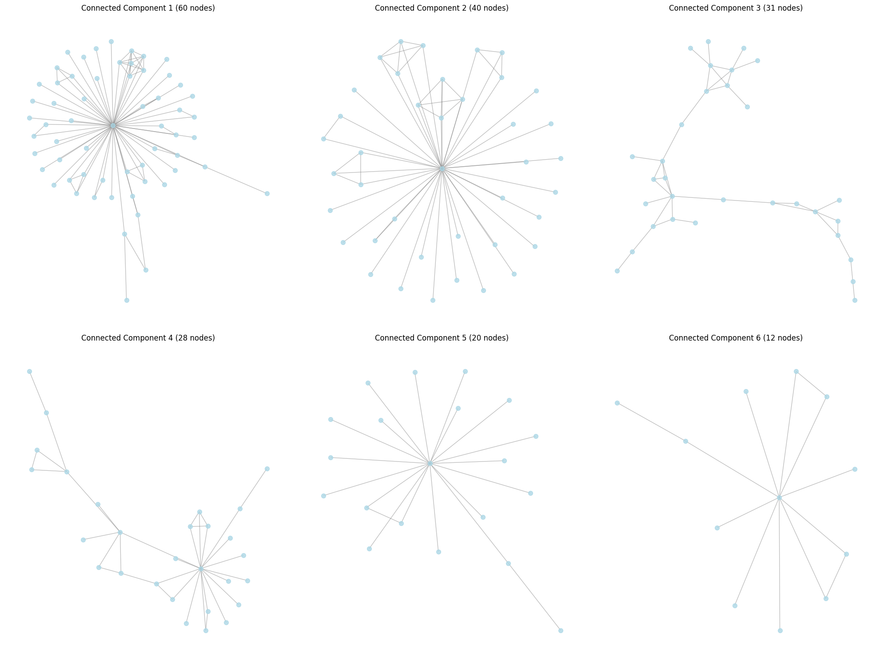
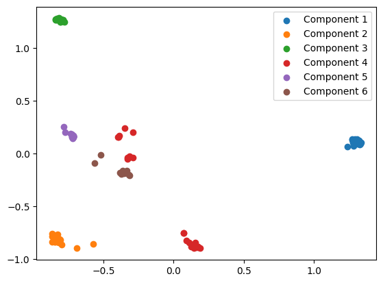
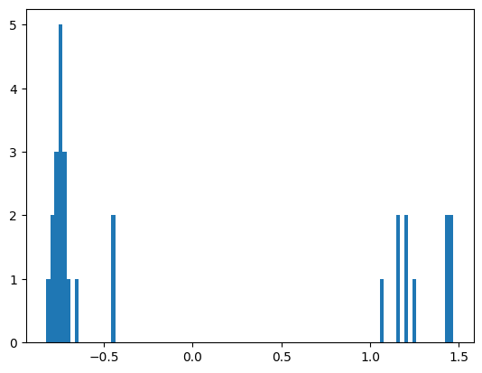
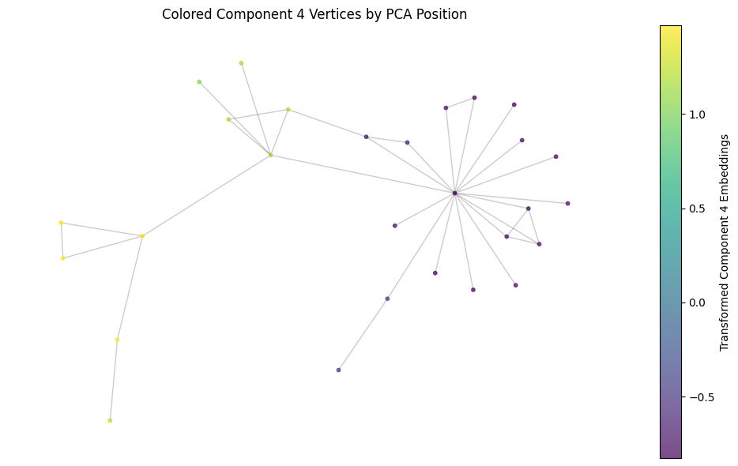

+++
title="Modeling Protein Evolution"
date=2024-10-05
+++

*See source code [here](https://github.com/skunnavakkam/protein-evolution-experiment)*

We construct a graph where nodes are amino sequences, and edges connect sequences with Levenshtein distance == 1. This is motivated by Maynard-Smith's model of protein evolution, where one protein can evolve into another protein if there is a path of functional proteins between them, all with Levenshtein distance 1.

For rigor, we limit the minimum sequence length to 20, since this supports our result, that we should only see *any* connected components *iff* Maynard-Smith's model is correct, even more.


```python
import networkx as nx
from itertools import combinations
import time
from pybktree import BKTree
import Levenshtein as lev  # Efficient Levenshtein distance computation
import numpy as np
import scipy.linalg as spla
from tqdm.notebook import tqdm  

# load "PDB Seqres.fasta"

with open("PDB Seqres.fasta", "r") as file:
    data = file.read()


proteins = data.split(">")[1:]
aminos = []
labels = []


for idx, protein in enumerate(proteins):
    try:
        aminos.append(protein.split("\n")[1])
        labels.append(protein.split("\n")[0])
    except:
        pass

# dedupe
aminos = list(set(aminos))
aminos = [amino for amino in aminos if "X" not in amino and len(amino) > 25]

n = 50000
aminos = aminos[:n]


def create_graph_bktree(aminos, k=1):
    """
    Create a graph where nodes are amino sequences and edges connect sequences with
    Levenshtein distance up to k, including insertions and deletions at the ends.

    Parameters:
    - aminos (list): List of amino acid sequences.
    - k (int): Maximum Levenshtein distance for edge creation.

    Returns:
    - G (networkx.Graph): The constructed graph.
    """
    G = nx.Graph()
    G.add_nodes_from(range(len(aminos)))  # Using indices as node identifiers

    # Build BK-tree using Levenshtein distance as the metric
    tree = BKTree(lev.distance, aminos)

    start_time = time.time()
    length = len(aminos)

    for idx, seq in tqdm(list(enumerate(aminos))):
        # Query for all sequences within distance k
        matches = tree.find(seq, k)
        for distance, match_seq in matches:
            neighbor_idx = aminos.index(match_seq)
            if neighbor_idx != idx:
                G.add_edge(idx, neighbor_idx)


    total_time = time.time() - start_time
    print(f"Total time for BK-tree graph creation: {total_time:.2f} seconds")
    return G


# Create the optimized graph with Hamming distance threshold k=2
graph = create_graph_bktree(aminos, k=1)
print(f"Number of nodes in the graph: {graph.number_of_nodes()}")
print(f"Number of edges in the graph: {graph.number_of_edges()}")

```


      0%|          | 0/50000 [00:00<?, ?it/s]


    Total time for BK-tree graph creation: 16.77 seconds
    Number of nodes in the graph: 50000
    Number of edges in the graph: 3341


We lower bound sequence length to 20. As a result, we will assume that all of our proteins are 20 amino acids long. This is not true, but it is a good approximation for the purposes of this analysis.

Take an initial string $s$. We can then estimate the number of strings that are Levenshtein distance 1 apart from $s$. This is approximately equal to 
$$
19 \times 20 + 20 \times 20 + 20 = 800
$$
These terms correspond to changing letters, inserting letters, and deleting letters respectively. We can then say that the probability of finding a string within Levenshtein distance 1 is given by 
$$
\frac{800}{20^{20}} \times 50000 \approx 0
$$

This means that it's quite cool that we see *any* connected components at all.

I think that this confirms Maynard-Smith's model of protein evolution, where one protein can evolve into another protein if there is a path of functional proteins between them, all with Levenshtein distance 1.


```python
import matplotlib.pyplot as plt
from pprint import pprint

# Plot the 6 largest connected components
plt.figure(figsize=(20, 15))

# Get the 6 largest connected components
connected_components = sorted(nx.connected_components(graph), key=len, reverse=True)[:6]

for i, component in enumerate(connected_components, 1):
    plt.subplot(2, 3, i)
    subgraph = graph.subgraph(component)
    
    # Calculate layout for the subgraph
    pos = nx.spring_layout(subgraph)
    
    # Draw nodes
    nx.draw_networkx_nodes(subgraph, pos, node_size=50, node_color="lightblue", alpha=0.8)
    
    # Draw edges
    nx.draw_networkx_edges(subgraph, pos, edge_color="gray", alpha=0.5)
    
    # Set title and adjust layout
    plt.title(f"Connected Component {i} ({len(component)} nodes)")
    plt.axis("off")

plt.tight_layout()
plt.savefig("six_largest_connected_components.png", dpi=300, bbox_inches="tight")
plt.show()
```


    

    


From each 6 of our connected components, we can project all of our proteins into an embedding space using some embedding AI model. We can then PCA this space, and see if connected components in the original graph correspond to clusters in the PCA space.


```python
import torch
from transformers import BertModel, BertTokenizer

if torch.backends.mps.is_available():
    device = "mps"
else:
    device = "cuda" if torch.cuda.is_available() else "cpu"

tokenizer = BertTokenizer.from_pretrained("Rostlab/prot_bert", do_lower_case=False )
model = BertModel.from_pretrained("Rostlab/prot_bert").to(device)
def get_bert_embeddings_batch(sequences, batch_size=32, len_seq_limit=300):
    '''
    Function to collect last hidden state embedding vectors from pre-trained ProtBERT Model in batches

    INPUTS:
    - sequences (list): List of protein sequences
    - batch_size (int): Number of sequences to process in each batch
    - len_seq_limit (int): Maximum sequence length for truncation

    OUTPUTS:
    - embeddings: List of embedding vectors for input sequences
    '''
    embeddings = []
    
    for i in range(0, len(sequences), batch_size):
        batch = sequences[i:i+batch_size]
        sequences_w_spaces = [' '.join(list(seq)) for seq in batch]
        
        encoded_input = tokenizer(
            sequences_w_spaces,
            truncation=True,
            max_length=len_seq_limit,
            padding='max_length',
            return_tensors='pt'
        ).to(device)
        
        with torch.no_grad():
            output = model(**encoded_input)
        
        batch_embeddings = output['last_hidden_state'][:,0].detach().cpu().numpy()
        embeddings.extend(batch_embeddings)
    
    return embeddings

embeddings = []  # 6 * n * 1024

for component in tqdm(connected_components, desc="Processing components"):
    component_sequences = [aminos[node] for node in component]
    component_embeddings = get_bert_embeddings_batch(component_sequences)
    embeddings.append(component_embeddings)

del model
```
The model is now loaded.

```python
embeddings = [np.array(component_embeddings) for component_embeddings in embeddings]
print(len(embeddings))
print(embeddings[0].shape)
concated = np.concatenate(embeddings, axis=0)

# Perform PCA on the concatenated embeddings
from sklearn.decomposition import PCA

# Initialize and fit PCA
pca = PCA(n_components=2)
# fit pca on concated
pca.fit(concated)

transformed_embeddings = [pca.transform(component) for component in embeddings]

# plot each transformed embedding, with a different color for each component
for i, transformed_embedding in enumerate(transformed_embeddings):
    plt.scatter(transformed_embedding[:, 0], transformed_embedding[:, 1], label=f"Component {i+1}")

plt.legend()
plt.show()


```

    6
    (60, 1024)


    

    
We quite clearly see that the proteins in Component 4 are split into two distinct clusters. Projecting this PCA into 1 dimension confirms this.


```python
# pca JUST component 4
pca_2 = PCA(n_components = 1)
pca_2.fit(embeddings[3])
transformed_embeddings_2 = pca_2.transform(embeddings[3])

plt.hist(transformed_embeddings_2, bins=100)
plt.show()


```


    



We can then color the nodes in the graph by this position in PCA space. We should see a clear change in this value at some point in the graph, hopefully cleaving the graph cleanly into two. Since the embedding represents functionality, I think this may show that the protein mutation develops a new function through evolution.

```python
# plot the nx graph of component 4
# color them by the magnitude of their index in the transformed_embeddings_2 array
plt.figure(figsize=(10, 6))
pos = nx.spring_layout(graph.subgraph(connected_components[3]))
nodes = nx.draw_networkx_nodes(graph.subgraph(connected_components[3]), pos,
                               node_color=transformed_embeddings_2,
                               cmap='viridis',
                               node_size=10,
                               alpha=0.7)
nx.draw_networkx_edges(graph.subgraph(connected_components[3]), pos, alpha=0.2)
plt.colorbar(nodes, label='Transformed Component 4 Embeddings')
plt.title('Colored Component 4 Vertices by PCA Position')
plt.axis('off')
plt.tight_layout()
plt.show()


```


    


Wow! I wonder if this change in functionality reflects a functional mutation!

