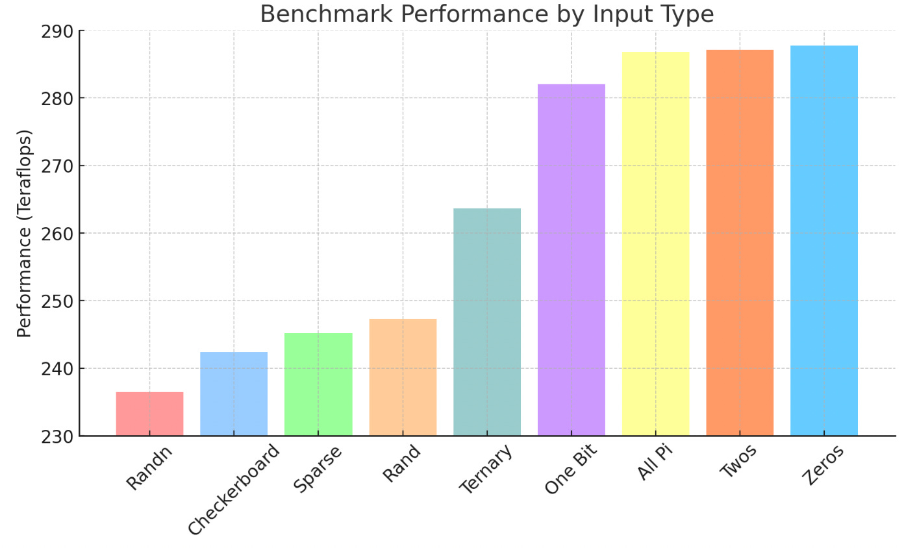

+++
title = "Using Power Draw as a Side Channel for Communication"
date = 2025-04-07
+++

*This project was inspired by [Gabriel Kulp] at RAND*

["Strangely, Matrix Multiplications on GPUs Run Faster When Given "Predictable" Data! [short]"](https://www.thonking.ai/p/strangely-matrix-multiplications) shows that multiplying two $n \times m$ matrices together does not take constant power even though it takes constant FLOPS. As a result, it may be possible to use these variations in power draw to send data in the power consumption of running inference on a GPU. This blog post tries to show how this may be done. 

It seems reasonable, as the referenced blog post does, that the difference in power draw is due to the difference in number of bitflips between the two matrices. As a result, even without concrete power draw information (in fact, I have no good way to obtain this since I don't have access to a CUDA GPU!) we can still try to estimate the power draw of a matmul. In addition, the referenced post has a nice ladder of different matrices that can be used as comparision points. 

*Power draw of matrix multiplication operations with different input patterns, showing variations in power consumption despite constant FLOPS (higher teraflops / s = lower power draw per matmul)*

Since I stipulate that power draw is due to bitflips, I should consider the order of memory access. I am referencing [this blog post](https://maharshi.bearblog.dev/optimizing-sgemv-cuda/) for how vector-matrix multipications (SGEMV) are done on CUDA. This should give me information about the memory access pattern of this multiplication.

The order of memory access within the matrix doesn't matter, since for vectors $v_1, v_2$ the energy of matrix access is the same. Instead, we just consider the memory access pattern of the vector.

It seems like that for some thread $i$, the thread process elements $i + bn$ for integer $n$, where $b$ is the blocksize of the GPU. We approximate this by saying that memory access on the vector is done sequentially. 

Define intravector complexity as an output $C$
$$
C = \sum_{i=0}^{n-1} d_{hamming}(v_i, v_{i+1})
$$

However, Hamming loss is a difficult optimization target, so how do we optimize for it?