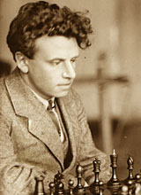

+++
title = "Soviet Chess Diplomacy"
date = 2024-11-25
+++

*this was written by 12 year old me, so it may be a little scuffed*

The Soviet Union is known for its chess. From the end of World War II to the collapse of the Soviet Union, 7 out of the 8 chess world champions were Soviet, with only Bobby Fischer being of non-soviet origin. Going through to the modern day, most of the former member states of the Soviet Union have produced influential chess players. However, the chess influence of the Soviet Union stretches beyond the borders of the USSR, and instead stretched to wherever the empire’s expansionism took it to.

# Chess in the USSR
The Soviet Union’s rich chess history begins during the Russian Civil War, during which the Bolsheviks used chess as a recruitment and educational tool. Prior to this, chess was reserved as a game for the elites. Alexander Petrov, the first great Russian master was born into a noble family, and the same applies to the many other high profile chess players before the Soviet Union. However, Lenin, an avid chess fan, encouraged chess due to its perception as a game of intellectuals.

<em>Alexander Fyodorovich Ilyin, 1927</em>

Chess in the USSR was kickstarted by Alexander Fyodorovich Ilyin, a strong but relatively unknown player. As a high-ranking officer in the Soviet military, he oversaw the introduction of chess into the Russian military program. After the end of the Russian Civil War, he started the tradition of the Soviet Chess Championship (then called the All-Russian Chess Olympiad). In the first edition of this tournament, future world chess champion Alexander Alekhine won. 

From here, chess became a larger part of Soviet politics. Many prominent Bolsheviks were involved in managerial roles for chess, and this furthered the push for stronger chess players in the country.

Pictured: Soviet Chess Propaganda Poster, text reads: “Let us become masters of cultural recreation”,

 1933

With this further involvement in chess, multiple tournaments were held, and chess players were allowed to leave the country for international play. Among the players traveling was Mikhail Botvinnik, the first chess world champion under the Soviet Union (Alehkine transferred to the French chess federation before winning his title). 

Mikhail Botvinnik, 1962

A prodigy, he qualified for the USSR championships in 1927 at the age of 16. His first major tournament win (outside of the USSR championships) came with the Leningrad championship (1932), where he scored 10/11, ahead of other strong players such as the aforementioned Ilyin. Botvinnik also won the USSR chess championships in 1931, 1933, and 1939. 

In the late 1930s and early ‘40s, Soviet chess encountered some turbulence through the wider Soviet political situation. In 1937, the Soviet Union carried out its great purge under Stalin, where political opponents and dissidents were eliminated. However, this also took out members of Soviet chess, such as head of chess and checkers, Nikolai Krylenko. 

In the late 1930s, the second world war was declared. The USSR was one of the most significant allied forces in this war, but despite this, the game continued. For example, in 1939, 1940, 1944, and 1945, the USSR chess championships still took place, despite the war spanning over all 4 championships, and the last stages of World War II in Europe happening over the 1945 championship.

After WWII continued the Soviet quest to dominate chess, and this came in the form of World Champion Mikhail Botvinnik. Botvinnik would then go on to lead the Soviet School of Chess, which produced hundreds of chess grandmasters and many world champions. 

The presence of strong players in the USSR led to them producing the best chess content in the world in the form of many magazines and chess books. This allowed them to export their chess content as propaganda and influence the chess of many countries around the world.

The May 1983 edition of 64, a prominent Russian chess magazine

# The Soviet Union’s Impact on International Chess
Through the Soviet Union’s foreign policy during the cold war, chess was proliferated in countries around the world in order to gain favor with politicians and citizens. Three countries with very different economic and political realities, India, Cuba, and the US, had all been influenced by Soviet chess, though not necessarily through governmental interference. 

## India
India has one of the richest chess histories of any country. The predecessor to international chess, Chaturanga, was invented there. However, international chess was not widespread in India until the 1960s, and rather, regional variants of the game were played with slightly different rules. For example, the pawn double move, and thus en passant, was absent.

The introduction of modern chess into India came in the form of Soviet Culture Centers. There were many of these cultural centers around India.

Russian Center for Science and Culture, Mumbai

Russian Center for Science and Culture, Delhi

Russian Center for Science and Culture, Kolkata

However, the most notable of these Cultural Centers (in terms of chess) is the Russian Center for Science and Culture in Chennai. 

The Soviet Culture Center (now Russian Center of Culture and Science) in Chennai

Through the Soviet Union’s Indo-Soviet exchange program, resources were being dedicated to integrate Indians into the Soviet way of life. 

In 1972, a student of Russian at this center, Manuel Aaron, noticed the presence of chess books in its library. Manuel Aaron was already an established chess player in India at this time: he had already won the Indian National title and the Tamil Nadu State Championship multiple times. Along with this, he was already an International Master, haven gotten his title in 1961. Seeing the presence of high quality resources, Manuel Aaron founded the Tal Chess Club on the 14th of August 1972, around the same time as the Fischer-Spassky match.

The Soviets contributed heavily to the success of the Tal Chess Club. They received chess magazines, wooden chess boards, chess clocks; and all for free!

The Tal Chess Club wasn’t the only location where the Soviets helped catalyze Indian chess. At the aforementioned Culture Center at Mumbai, Soviet resources were used to teach students from the 70s through to the 90s, but not as many resources were devoted to chess as were in Chennai.

The impact of Soviet influence on chess in India. Many might know the story of Vishwanathan (Vishy) Anand. After finding an interest for the game in Manila, he played and studied at the Tal Chess Club, before being the highest rated Indian player of all time, a former world champion, and India’s first grandmaster.

Anand after winning the World Junior Championship, 1987

Funnily enough, a 19 year old Anand did play Tal once in a French Blitz tournament, which Anand eventually won. 

The Tal Chess Club, the powerhouse of early Indian chess, also gave to India more than a world champion. Two of the most notable players who played at the club were RB Ramesh, one of the most successful chess coaches of all time, and Subai Vijayalakshmi, India’s first WGM, though many dozens of strong titled players and prodigies were also present there. 

Through the Tal Chess Club in Chennai, the Russian House in Mumbai, and providing the environment for Vishy to flourish, Soviet influence has had a heavy influence in chess culture in India. The center was eventually shut down when the Soviet Union collapsed and funding ran dry. 

## The USA
The United States was the world’s leading anti-communist power during the Cold War. It is due to this that many might be surprised that the US was heavily influenced by Soviet chess, but this was mainly due to Soviet defectors.

As chess became a larger part of Soviet bureaucracy and politics, and as the USSR got more authoritarian under Stalin, chess players felt more pressure to perform and obey. This led to a wave of defectors, especially during the 50s and 60s. Since chess players were allowed to travel internationally, these chess players had greater opportunity to leave the country, and as such, many of them did. 

One such player was Pal Benko. Benko was a Hungarian player, who started playing tournaments at the late age of 17. He improved rapidly after this though, managing to win the Hungarian championship at 20. Through winning the Hungarian championships, he qualified for the 1952 Interzonal, where the best players from each region would compete. The top 6 players from the Interzonal would then qualify for the Candidates tournament, where they would be joined by the loser of the World Championship and the second place finisher of the previous candidates. 

Pal Benko, 1964

However, he wasn’t able to participate. After qualifying for the tournament, but before actually playing in it, he attempted to defect while in West Berlin. He was arrested and placed in a Soviet concentration camp, since Hungary was a Soviet satellite state at that point. Fortunately for Benko, Stalin died a year and a half later, and he was released as a number of other political prisoners were pardoned. 

Benko was still banking on defecting, and about 5 years later, an opportunity reared its head. After the 4th World Student Chess Championships in Reykjavik, Pal Benko headed for the US embassy in Iceland and requested asylum, which he was granted. 

 

4th World Student Team Championships, 1957

He represented Hungary on Board One at this tournament, and led the team to 4th place.

While in the US, Pal Benko had one of the most impressive and influential careers of any American player. He won a record 8 US open chess championships (different from the US Chess Championships), beat four world champions, played at 6 chess olympiads, and was estimated to be the 17th strongest player in the world. 

US Olympiad Team, 1970, credit: @BertolaGeorges on Twitter

Benko also played a fundamental role in getting Bobby Fischer to win the World Championship. After qualifying for the famous 1970 Interzonal Tournament, he instead gave up his spot to Fischer, who went on to win the World Championship cycle that year, before becoming a recluse. 

This story of Pal Benko, possibly the most famous chess defector, is not a one off, and many other players from the Soviet Union and the Eastern Bloc have defected from the USSR to the US. The US was also special in this sense, since it was fighting the other side of the Cold War, and defectors thus gave it preference. Other defectors have also gone on to have successful chess careers.

Lev Alburt was a Ukrainian who defected in 1979. While in the United States, he became thrice US champion

Roman Dzindzichashvili, while not a defector, was another player who emigrated to the US from the USSR, and shared the US championship once. 

Lubomir Kavelek was a czech chess player, who defected in 1968 after playing a tournament in Poland. He won the US chess championship in 1978.

Other Soviet Players such as Gata Kamsy, Boris Gulko, Alexander Ivanov, Alex Yermolinsky, Alexander Shabalov, and a few others, left the Soviet Union, either through being allowed emigration or after its collapse, for the US, and all went on to win the US chess championship at one point. 

## Cuba
As a strong ally of the USSR, chess in Cuba was built both through diplomatic relations by the USSR, but also through the influence of Capablanca and Che Guevera.

Cuba has had a rich chess history since western chess has been in the US. There are accounts of Columbus playing chess in Cuba. The first chess “automaton”, the Turk (which was actually a chess master in a box), was invented in Cuba. The first great American chess player, Paul Morphy, played chess in Cuba often.

Cuba’s first top player came in the form of Capablanca, arguably one of the greatest chess players of all time, and a father of modern chess. After Capablanca’s death, the Capablanca memorial was held annually in Cuba, but was scaled up after Che Guevera and Castro overthrew the US backed dictator in Cuba. 

The Soviet influence in Cuba chess was just encouragement for Guevera to pour money into chess, similarly to the USSR.

The first instance of this was with the Capablanca memorial in 1962, where Guevera lavishly funded prizes for the World Class players at the Havana Hilton.

In addition, Guevara also looked for hosting the Chess Olympiad in Cuba, with the cooperation of other latin and south american chess players. The olympiad was held in 1966, with teams from the USSR, US, and Hungary finishing top 3. 

While the USSR didn’t directly affect Cuban chess that much, the allyship between the USSR and Cuba affected the lives of participants. For example, at many of the aforementioned Capablanca memorials and Olympiads, American players, mainy Bobby Fischer, were not allowed to play due to the fear of Communism by the US state. In addition, as a rather patriotic American, Fischer had issues associating with Cuba, but Guevera’s lively personality held relationships between the two, according to anecdote. 

While Cuba was likely the country in the list least influenced by the USSR, as a communist country, it still had a rich chess history, and I felt like it was worth mentioning. 

# Soviet Influence After Collapse
The Soviet Union collapsed in 1991. However, this doesn’t mean that the culture of chess that existed died with it. 17 of the 38 (47%) chess players rated over 2700 came from countries that were part of the USSR or Eastern Block. In addition, Russia’s effect on World Chess is still large, having hosted multiple chess olympiads and having the current president of FIDE, chess’s governing body.

With the growing popularity and democratization of free chess websites like lichess.org or chess.com, it’s unlikely that we will see another country dominating chess like the USSR. However, Soviet games, books, and players have already been solidified in history.

