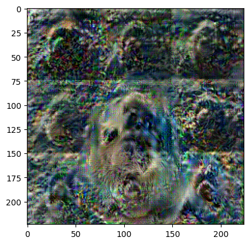

+++
title="Gradient Inversion Attack"
date="2025-03-24"
description="A replication of the paper Deep Leakage from Gradients to reverse-engineer the training data from the gradients of a neural network in training."
+++

This is a replication of the paper [Deep Leakage from Gradients](https://arxiv.org/abs/1906.08935).

The gist of the paper is that it is possible to reverse-engineer the training data from the gradients of a neural network in training. 

Given some machine learning model $f(w, x)$, and some ground truth training data $(x, y)$, we can use the gradients of the model to reconstruct the training data.

To do this, we initialize a random image $x_i$, and a random label $y_i$. 

We then are given the gradient of the weights of the model, $\nabla W$

We can then run inference on the new training data to get the gradients of the new weights, $\nabla W_i$

We then compute a new loss function $L = ||W_i - W||^2$

We then find $\frac{\partial L}{\partial x_i}$ and $\frac{\partial L}{\partial y_i}$ to update our image and labels.

For this, we only care about the image, and it works beautifully!

Reference image:

Reconstructed image:

It seems like the 3x3 tiling here is due to the convolutional layers in the model. 

