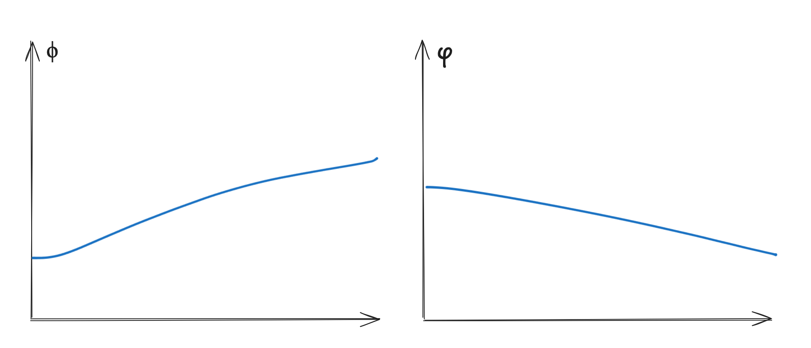

+++
title="Why does my reward look like *that*?"
date=2025-07-17
draft=false
+++

I've been training language models with reinforcement learning recently, and see some
interesting behavior with my rewards. 

Let's set up the problem by saying that I'm running Group Relative Policy Optimization (GRPO)
with two reward functions $\phi$ and $\varphi$, with my final reward $r = 4 \cdot \phi + \varphi$.
I'm using weights on my rewards because I wanted to encourage $\phi$-like behavior in my model.

This is what my rewards look like.

The shape here isn't very important. What you should notice is that $\phi$ climbs while $\varphi$
goes down. Net reward also goes up, although this isn't pictured.

This makes sense if $\phi$ and $\varphi$ rewarded opposite things, but I don't think this is the case.
I think $\phi$ and $\varphi$ are orthogonal, and that you can have many different values of $\varphi$ 
for a given value of $\phi$.

Instead, I have another explanation here. 

Let $u, v$ be vector directions in activation / weight space which roughly represent $\nabla \phi$ and $\nabla \varphi$ respectively (a direction that maximizes $\phi, \varphi$ respectively). Let the model start off with some
parameter set $\theta_0$ and represent the model as a function $M$ of $\theta$, with two components $M_u(\theta) = \phi(M(\theta))$ and $M_v(\theta) = \varphi(M(\theta))$. 

I make the load-bearing claim that the KL divergence required to increase $u$ is larger than the KL divergence required to decrease $u$ and so forth for $v$. Namely, for $\theta_{+u}, M_u(\theta_{+u}) > M_u(\theta_0)$ and $\theta_{-u}, M_u(\theta_{-u}) < M_u(\theta_0)$, 

$$
KL(\theta_{+u} || \theta_0) > KL(\theta_{-u} || \theta_0)
$$

This is a strong claim, but I think holds  true. For example, small distributional changes can cause the model to forget a sign when doing math, but making non-trivial gains in math is hard. This leads to the model being less likely to generate things with $+u, +v$ and more likely to generate things with $-u, -v$. Some version of this can be strengthened using Markov's variance bound.

Then, look at the reward in the cases $+u, -u, +v, -v$. (table 1)

|          | + $\Delta v$       | - $\Delta v$         |
|----------|------------|------------|
| + $\Delta u$       | +  | +  |
| - $\Delta u$       | -  | -  |

In both cases, where $\Delta u$ is positive, the reward, and thus advantage is positive. However, since $p(\delta u > 0, \delta v leq 0) > p(\delta u > 0, \delta v > 0)$, the model is more likely to optimize on the $+u, -v$ case.

However, this will not always be true. If $\varphi$ ever gets too low, it becomes very easy to optimize for $\varphi$ and the expectations work out in favor of $\varphi$. Thus, even though the $\varphi$ reward is decreasing, accounting for it in the reward function causes pressure to maintain / not fall too much. 

