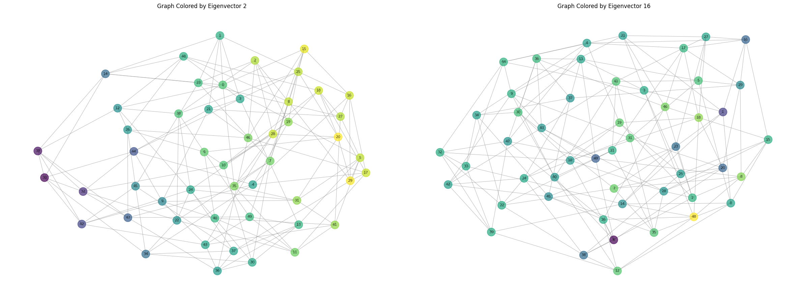
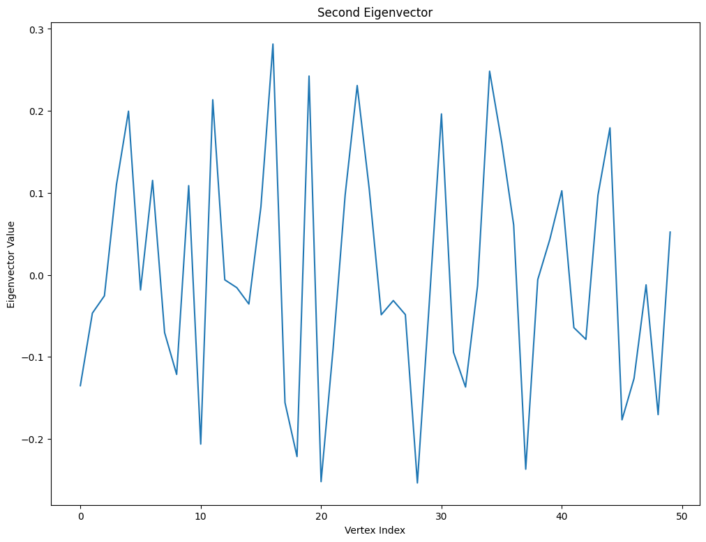

+++
title="Eigenvectors of the Graph Laplacian hold Spectral Information"
date=2024-10-06
+++

I want to give (and gain) some intuition about a specific phenomenon. This is a phenomenon from Spectral Graph Theory! Namely, when we take this matrix called the graph Laplacian. We define it for a graph $G = (V, E)$ as $L = D - A$, where $D$ is the degree matrix 

$$
D = \begin{pmatrix}
degree_{1} & 0 & 0 & \cdots & 0 \\
0 & degree_{2} & 0 & \cdots & 0 \\
0 & 0 & degree_{3} & \cdots & 0 \\
\vdots & \vdots & \vdots & \ddots & \vdots \\
0 & 0 & 0 & \cdots & degree_{n}
\end{pmatrix}
$$

and $A$ is the adjacency matrix. 

Treat the eigenvectors of the Laplacian as a function $F: V \to \mathbb{R}$. When you color the vertices of a graph according to the value of the function at those vertices, the color follows a smooth gradient for low eigenvalues, and the coloring is not smooth for high eigenvalues. 
```python
import networkx as nx
import random
import matplotlib.pyplot as plt

n = 50  # number of vertices
d = 6 # degree of each vertex

def generate_d_regular_graph(n, d):
    """
    Generate a random d-regular graph with n vertices and no self-cycles.
    
    Parameters:
    n (int): Number of vertices
    d (int): Degree of each vertex
    
    Returns:
    nx.Graph: A d-regular graph
    """
    if n * d % 2 != 0 or d >= n:
        raise ValueError("n * d must be even and d must be less than n")
    
    # Create an empty graph
    G = nx.Graph()
    G.add_nodes_from(range(n))
    
    # Create a list of available stubs (connection points)
    stubs = list(range(n)) * d
    
    while stubs:
        # Randomly select two different stubs
        u, v = random.sample(stubs, 2)
        
        # Ensure no self-loops and no multiple edges
        if u != v and not G.has_edge(u % n, v % n):
            G.add_edge(u % n, v % n)
            stubs.remove(u)
            stubs.remove(v)  

        import sys
        sys.stdout.write("\r" + " " * 20 + "\r")
        sys.stdout.write("\r" + f"Number of stubs remaining: {len(stubs)}")
        sys.stdout.flush()
    print()
    return G

graph = generate_d_regular_graph(n, d)
print(f"Generated a {d}-regular graph with {n} vertices")
print(f"Number of edges: {graph.number_of_edges()}")

# plot the graph

plt.figure(figsize=(12, 9))
pos = nx.spring_layout(graph, k=0.5, iterations=50)
nx.draw(graph, pos,
        node_color='lightblue',
        node_size=300,
        with_labels=True,
        font_size=8,
        edge_color='gray',
        width=0.6,
        alpha=0.7)
plt.title(f'Random {d}-Regular Graph with {n} Vertices', fontsize=16, fontweight='bold')
plt.axis('off')
plt.show()

import numpy as np
import networkx as nx
import scipy.linalg as sla
import matplotlib.pyplot as plt

laplacian_matrix = nx.laplacian_matrix(graph).toarray()
eigenvalues, eigenvectors = np.linalg.eigh(laplacian_matrix)
eigenvectors = eigenvectors.T

vector_nums = [1, 15]
fig, axs = plt.subplots(1, 2, figsize=(24, 9))

for i, vector_num in enumerate(vector_nums):
    curr_vector = eigenvectors[vector_num]
    
    # plot the graph, and color the vertices by the values in the eigenvector
    nx.draw(graph, ax=axs[i], node_color=curr_vector, cmap='viridis', node_size=300, 
            with_labels=True, font_size=8, edge_color='gray', width=0.6, alpha=0.7)
    axs[i].set_title(f'Graph Colored by Eigenvector {vector_num + 1}')
    axs[i].axis('off')

plt.tight_layout()
plt.show()
```




We can first try to show something like this for the continuous case. Start by defining the laplacian operator 
$$
L = \frac{\partial F^2}{\partial^2 x}
$$

We want to find some eigenfunction, which is a function $f$ such that 
$$
Lf = \lambda f
$$
for some eigenvalue $\lambda$. 

We can show that the *only* functions that satisfy this are of the form $f(x) = A\sin(kx) + B\cos(kx)$. It is trivial to verify this, and it's a little more involved to prove this (but it is true!)

As a result, for some function $F(x) = A\sin(kx) + B\cos(kx)$, we have that that $F''(x) = -k^2 A \sin(kx) - k^2 B \cos(kx) = -k^2 F(x)$. Thus, for the eigenvalue $\lambda$, we know that it corresponds to a component with frequency $k = \sqrt{-\lambda}$. A result from the theory of Fourier analysis is that you can decompose any function into a sum of sines and cosines and that the eigenvectors of the laplacian are the components of the function. 

We can fall on the limit definition of the Laplacian, which says that 
$$
Lf = \lim_{h \to 0} \frac{f(x+h) + f(x-h) - 2f(x)}{h^2}
$$

If we instead say that our value of $h$ is a discrete value, we get a definition of the Laplacian for a grid that has $n$ dimensions.

$$
Lf(v) = \sum_{i \in [n]} \frac{f(v + x_i) + f(v - x_i) - 2f(v)}{||x_i||^2}
$$

where $x_i$ is the "step" vector in the $i$th dimension. It is fairly easy to see that as $||x_i|| \to 0$, the definition of the Laplacian converges to the definition of the Laplacian operator. Furthermore, this is equivilant to increasing the number of points in the grid, while keeping $||x_i|| = 1$

We now can pair up adjacent vertices of the graph with edges, setting lattice points to vertices and the connections to edges. We then want to show that the Laplacian converges to the Laplacian operator, for some function $F: V \to \mathbb{R}$, which is a vector in $\mathbb{R}^n$. 

We start with two defintions of the Laplacian, and aim to show that they are the same.
$$
Lf = Df - Af
$$

$$
Lf = \sum_{u \sim v} \frac{f(v) - f(u)}
$$

where $u\simv$ denotes all $u$ such that there is an edge between $u$ and $v$. Since the number of edges connecting to a vertex is equal to the degree of the vertex, we can say that 

$$
Lf = \sum_{u \sim v} \frac{f(v) - f(u)} = d f(v) - \sum_{u \sim v} f(u)
$$

$$
= Df - \sum_{u \sim v} f(u)
$$

$$
= Df - Af
$$

We can then partition $U = {u \sim v}$ into two sets of equal size $U'$ and $U''$. We can then rephrase the operator $Lf$ as 

$$
Lf = \sum_{i \in [\frac{|U|}{2}]} f(u_i') + f(u_i'') - 2f(v)
$$

This is now the same as the discrete grid Laplacian, which is equivilant to the definition of the Laplacian operator in the limit as the grid size goes to infinity.

However, note that this works on only specific constructions of the graph $G$, while the actual result emperically works for many other graphs. While talking with a friend at Caltech, we realized that this was in part related to the how the graph drawing software `NetworkX` chooses to draw graphs. Namely, plotting the index vs the value of the eigenvector at the index does not result in a smooth gradient for any eigenvalue. 



The graph drawing algorithm solves the spring problem, which does the following:
- Treat each edge $e$ as a spring, with equilibrium length $l$, spring constant $k$, and current length $x_e$. Both of these values are equal for all edges.
- Compute the total potential energy of the system, $PE =\sum_{e \in E} \frac12 k (x_e - l)^2$
- Minimize $PE$, which is done through iteratively applying Hooke's law, $F = -k x_e$.

This smoothness breaks for large graphs, but I think that this is much more because the loss landscape is uglier for large graphs and thus the optimal graph cannot be achieved, and not because the optimal graph does not show smoothness. I still haven't truly solved this, haha.


