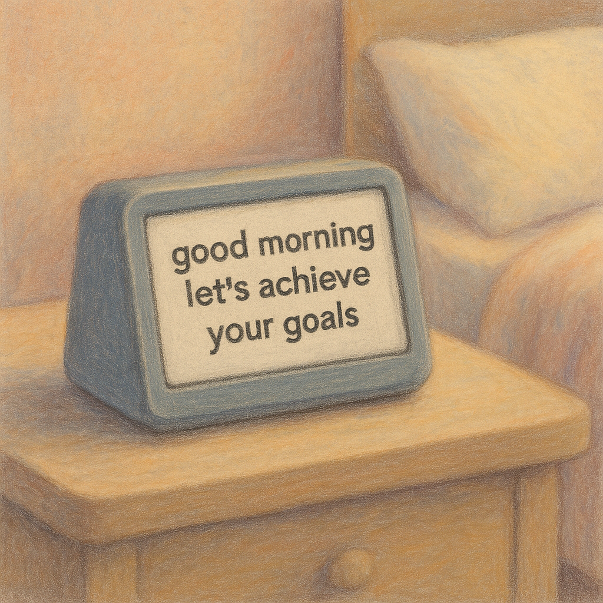

+++
title="The Village Elder"
date="2025-08-11"
description="My vision of how we interact with AI in the future"
+++

AI has been a new form of Human Computer Interaction for me. Recently, a larger
and larger portion of my time is spent in a chat interface or Cursor. An estimate
is that this is significant, where the first thing I turn to is often o4-mini 
through the ChatGPT app. I currently only use language models as a tool for 
programming, biology research, or simple QA, but they are useful tools, and 
these tools can be used for **more**.

In one of my ideal worlds, technology lives in the background of life, and serve the goal of 
promoting *human* flourishing. They provide a small, positive impact to your day,
and help you get things done. In the ideal world, having the technology doesn't
stifle your ability to get out of bed, leave the house, meet people, or date. 
Having technology should help you get these things done. Technology now tries
to scratch this itch, and it fails. Generalist agents might help.

The village elder is a name I'm giving for a way to interact with a generalist
agent to help. 

The elder is best characerized by Its personality. It is not syncophantic. It 
makes sure that what it's doing is in the best interest of the person, as a whole.
The elder does this by a smarter supervisor model check if interactions with the
elder are positive marginal utility for the person. The elder turns away people
from conversation if the conversation is not positive marginal utility, with 
some leeway.

The elder is a rejection of the monetization of technology through capturing your
attention. It forces the person to leave the house and be in control of them 
as a person. You will be able to ask It for help like you do now, and It will 
still write code for you. 

However, It will tell you to take time off work if you need it, it will be a tool
for advice. It is named the elder because It fits the archetype of a wild, old 
sage, where it is near all knowing and caring.

The elder has access to everything in your house, and It uses it sparingly. The
elder checks your social media if you'd like it to, and kicks you off social 
media if you're spiraling on a doomscroll.

The elder replaces almost all of your other technology. The future is simple,
with text editors, browsers, and minimal Linux interfaces to reduce technology
to the coolest tool we have. The elder helps you self-express, helps you build
the things you want, helps you feel fulfilled.

The machine fades into the background, and is everywhere. You are awake, you are
light, and you flourish. You learn what you want and you meet the world 
where it meets you.

