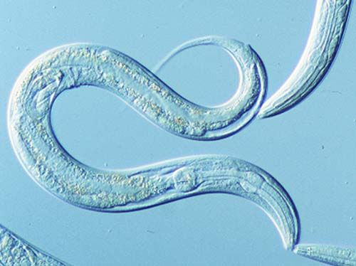

+++
title="Training a Small SAE on a Worm"
date=2025-08-25
draft=false
description="Training a sparse autoencoder on calcium traces of 189 C. Elegans neurons to interpret behaviors"
+++

C elegans (Caenorhabditis elegans) is a nematode worm with 302 neurons. This small number of neurons makes it an ideal model organism to study brains. As such, it has been used for things like whole brain emulation, connectome research, etc. As a result, we have extremely good optogenetic control over these worms, and have quite a comprehensive ability to read and write to a large fraction of the worm's neurons.



At the same time, we've been able to peer deeper into machine brains through having access to every neuron's activations, being able to train models to help us get a better understanding of what happens in the machine. One such model is the sparse autoencoder, which I first encountered through Anthropic's work on dictionary learning.

To start, we load in a dataset of 189 calcium traces of worm neurons under different stimuli (I still can't believe there isn't a 302 neuron C Elegans activation dataset! also finding the dataset was by far the hardest part here). We then define a 1x expansion factor SAE on the neurons such that

$$
a = ReLU(W_{enc} x + b_{enc}); x^* = W_{dec} a + b_{dec}
$$

Then, train this with MSE + Sparsity loss. After training, we autointerpret the SAE to see if we can pull out any selectivity for stimulus.

And yes! Some SAE neurons are selective for stimuli:

```
Stimulus: 10mM CuSO4  (n_on=480, n_off=4499)
  #01 unit 180  d=+0.334  on=6.562 off=5.358
  #02 unit  20  d=+0.158  on=1.380 off=1.064
  #03 unit 352  d=+0.080  on=0.572 off=0.471
  #04 unit 214  d=+0.035  on=3.296 off=3.111
  #05 unit 234  d=+0.000  on=0.000 off=0.000
```

```
Stimulus: Control  (n_on=479, n_off=4500)
  #01 unit 180  d=+0.612  on=7.348 off=5.274
  #02 unit 331  d=+0.599  on=1.275 off=0.457
  #03 unit   1  d=+0.570  on=3.326 off=1.147
  #04 unit 366  d=+0.517  on=6.454 off=2.993
  #05 unit 323  d=+0.410  on=1.244 off=0.591
  #06 unit 359  d=+0.327  on=0.976 off=0.341
  #07 unit 238  d=+0.090  on=0.053 off=0.037
```

where the unit corresponds to the hidden neuron.
